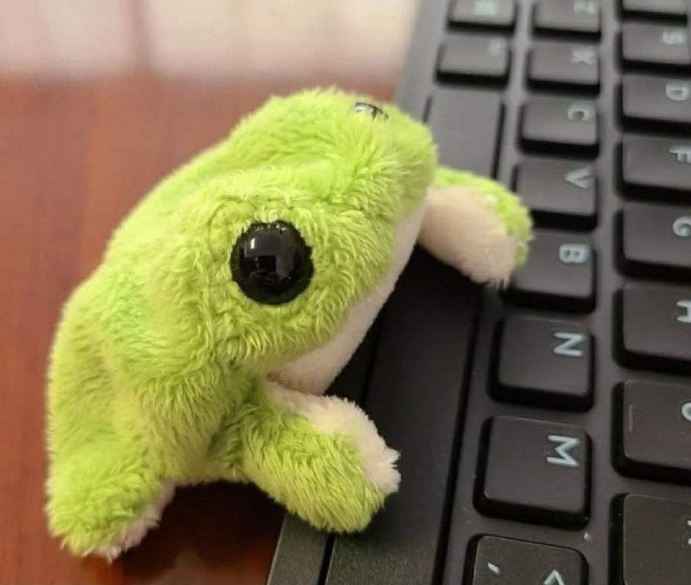

# MMED-1054 Homework 1 Assignment
This is a repo for our Homework 1 Assignment for MMED-1054.

## Jo Muncaster - About Me

### Name & Age
My name is Jo Muncaster, I'll be turning 2️⃣9️⃣ in June!

### Background
I'm half Filipino 🇵🇭 & half Canadian 🇨🇦

### Hobbies
- Reading 
- Playing video games with friends
- Creating art

### My Favourite Movies
- Lord of the Rings
- Big Fish
- Howl's Moving Castle

### My Life in Emojis
# 📚🌱🫐🎮

## Amy Armstrong - About Me

### Name
My name is Amy Armstrong. I'm turning 2️⃣2️⃣ in March!

### Background
I'm half English 🏴󠁧󠁢󠁥󠁮󠁧󠁿 & half Filipino 🇵🇭!

### Hobbies
- Working out
- Drawing
- Time with friends & family

### Fun Fact
I have 5 animals. I have 3 cats, 1 dog, and a bunny!

### My Life in Emojis
# 🏋️‍♀️🎨🍻⛺️

## Installation
No installation required

## Usage
Open in a browser of your choice

## Contributing
Submit a pull request

## Credits
Jo Muncaster and Amy Armstrong

## License
See licence file